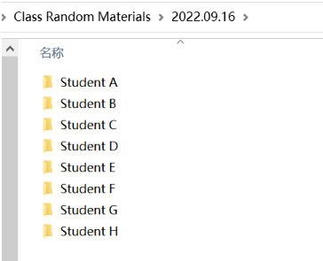

# wdhi (Who did/didn't hand in)
作为班委或课代表的你是否厌倦了总是清点谁没交作业/材料的生活？

那么这个小程序或许能帮上你的忙~

### 使用方法

创建一个时间表(其他也行)，在每个文件夹中你可以给你要管理的所有人各一个文件夹，并且把这个小程序放在其中，如下图所示：

将从每个人那收集来的材料或作业放在他们对应的文件夹中：

之后，直接打开wdhi.exe，或是用cmd、PowerShell运行这个程序都可。

# wdhi (Who did/didn't hand in)
As a class committee member or class representative, are you tired of always checking who hasn't handed in homework/materials?

Then this little program may help you :]

